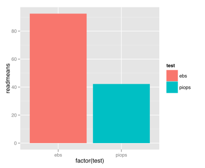

---

# Real Data

---

# I'm Mark Sonnabaum

@msonnabaum

Performance engineer at [Acquia](//acquia.com)

---
.title-slide

# The problem

---
.screenplay

CLIENT
> The homepage is really slow.

DEVELOPER
>Hmm…there are a lot of views on that page. I'll turn on devel query log and see what's going on.

---
.screenplay

Developer turns on query log, starts "optimizing"

DEVELOPER
> I found some custom queries that were called multiple times, so I added a static cache. It feels faster now.

CLIENT
> The home page is still slow.

---
.screenplay

DEVELOPER
> Well, the only other options left are to add a MySQL read slave or use ESI.

Mark slaps Developer.

---

## HOW TO FIX PERFORMANCE ISSUES
1. Diagnose
2. Research potential solutions
3. Evaluate effort/complexity of proposed solutions
4. Implement solution

---
.fragment

# diagnose

All other steps dependent

Most difficult

Easiest to fuck up

---
.fragment

## Consequences of misdiagnosis

Premature optimization

Micro-optimization

Solving problems you don't have

---

## “optimizations” are not free

* Code is less readable
* Code is more bug-prone
* Increased memory usage (static caches)
* Site/infrastructure is more complex, difficult to manage

---
.fragment

# But I'm a developer! I'm a man of science!

## Sort of?

---

## Who cares what you *think* the problem is
# Just measure it

---
.title-slide

# Collecting data

---

## Response time (PHP)

- Profile it (anything else is guessing)
- Ideally with XHProf

---

## Don't use ab to measure code changes

### What you're measuring with ab:

- Network
- Load balancer
- Proxy cache
- Web server
- Drupal/PHP <-- What you actually need to measure
- MySQL

---
.fragment

## Front end

Learn the Chrome dev tools

DOMContent and Load (red and blue lines)

---
.fragment

## Webservers

# PLEASE STOP BENCHMARKING WEBSERVERS

---
.fragment

## Custom measurements

Record the raw data, not calculated values

I like CSV, long-form

---
.title-slide

# Confounding variables

## Why most benchmarks on the internet are meaningless

---
.internet-benchmarks

---
.fragment

## You can't always remove them all
## Find the balance between isolation and realism

---
.fragment

# How I avoid:

Work in a **known**, clean environment

Recreate the problem in this environment

Isolate what you changed, only measure that

---
.title-slide

# Interpreting Data

---

# [R](http://r-project.org) 

A programming language and environment for statistical computing and graphics.

---
.ggplot_compare

# Plots

R has built in plotting, but I like [ggplot2](had.co.nz/ggplot2/)

 vs 

---
.big-image

## Time-series plots: line

---
.big-image
## Time-series Plots: Area

---
.big-image

# Plots: Bar

---
.big-image

# mean(avg)--

---
.big-image

# Boxplots++

---

# Resources

- [Introductory Statistics with R, Peter Dalgaard](http://www.amazon.com/Introductory-Statistics-R-Computing/dp/0387790535)
- http://stackoverflow.com/questions/tagged/r
- http://stats.stackexchange.com/

---

# Thanks.

# Questions?

## @msonnabaum

Provide feedback: http://munich2012.drupal.org/program/sessions/real-data-why-your-intuition-isnt-trustworthy

---
